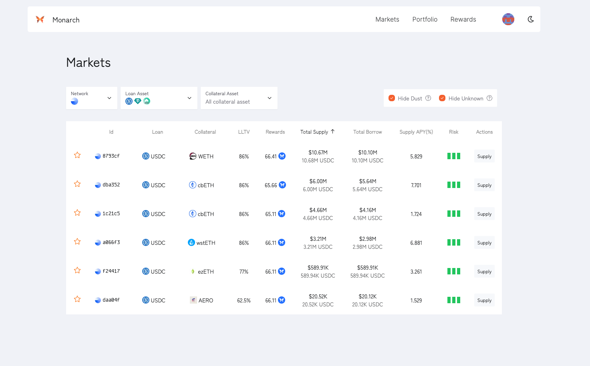

<div align="center">
  <h1 > Monarch </h1>
  
  <h5 align="center"> Easy access to Morpho Blue.</h5>
</div>



## Overview

Monarch is an unofficial user interface designed to facilitate access to [Morpho Blue](https://github.com/morpho-org/morpho-blue) markets. It provides a streamlined way to supply to any markets created on the Morpho Blue protocol, without the need for MetaMorpho vaults.

## Local Setup

Follow these steps to run the Monarch UI on your local machine:

```shell
# Clone the repository
git clone git@github.com:antoncoding/monarch.git

# Navigate into the 'web' directory of the 'monarch' repository
cd monarch/web

# Install dependencies
yarn

# Start the development server
yarn dev
```
